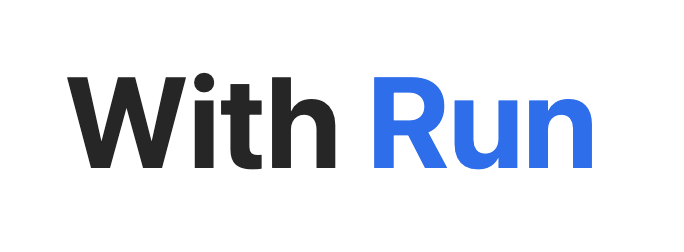

  

# 🏃‍♂️🏃 WithRun의 Back-end 레포지토리입니다.

### 📌 런닝인들의 런메이트 매칭, 크루 홍보 및 식단 관리 서비스

> 위치기반서비스를 이용하여, 가까운 동네에서 함께 뛸 수 있는 사람을 구할 수 있으며  
> 런닝 크루를 운영하고 있는 경우 본인의 크루를 홍보하여 멤버를 모집할 수 있습니다.
> 또한, 런닝인들이 식단을 유기적으로 관리할 수 있도록 음식 사진을 올리면 그 음식의 총량을 추정하여 영양소를 분석해줘요!

## 🏃 Period  
2021.10~ 개발 진행 중  

## 🏃‍♂️ Members
**M17 팀**  
> 미디어학과 17학번끼리 팀이 되어 M17 이라는 팀명을 지었습니다.  
> '미디어프로젝트'의 주제로 이를 선정하여 아이디어를 공유하며 서비스를 기획하고 제작하게 되었습니다!

* 🏃‍♂️ 최현욱 (팀장, BACK-END)  
[visit github](https://github.com/chu9741)  
* 🏃 김승민 (FRONT-END)  
[visit github](https://github.com/turfguy)  


## 🏃‍♂️ Technology used  

  ### 📌 Backend 스택
        - 백엔드 스택 어떤거 쓰셨는지, 왜 쓰셨는지(장점,특징) 등 작성해주세요. 
  
 ### 📌 DevOps 스택 
        - DevOps에서는 어떤 스택이 사용됐는지, 왜 쓰셨는지 작성해주세요.   
  
## 🏃 주요기술 
### 📌 백엔드에서 작성한 API 이름
  
    
  - 사진 첨부(필요시) 하시고 API에 대해 설명해주세요.
  


## 🏃 How to process 
* Running backe-end
```bash
# intall
$ npm install -g create-next-app
# make my project
$ npx create-next-app my-app
# start project
$ npm run dev

```
 Backend process 써주세요. 
 
## 🌈Contact
-최현욱: chu9741@ajou.ac.kr  
-김승민: ksm0811@ajou.ac.kr  
